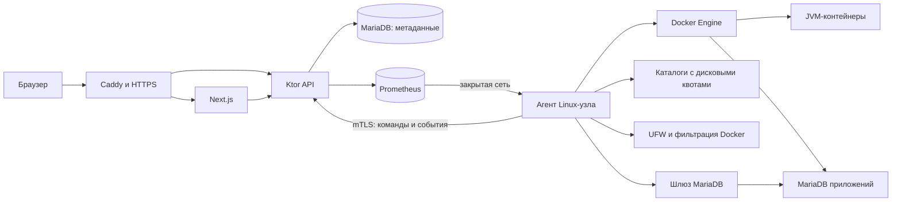

# План разработки панели управления JVM-приложениями

Дата: 4 октября 2026 года. Статус: проектный план, реализация по этапам.

Цель: создать собственную веб-панель хостинга, в которой пользователь регистрируется по приглашению, создаёт JVM-приложение, задаёт JDK и ресурсы, загружает файлы, управляет запуском, наблюдает за работой и администрирует MariaDB.

Зафиксированные требования: **Next.js для фронтенда; Kotlin + Ktor для бэкенда; один Linux-сервер в первой версии; архитектура с добавлением узлов; только MariaDB с первого выпуска; Caddy Server; управление системными портами через UFW; установка первого MVP на Ubuntu Server 24.04 LTS одной Bash-командой из GitHub в `/opt/jvm_dashboard/`.**

## 1. Результат первой полноценной версии

Первая версия должна предоставлять весь основной пользовательский сценарий:

1. Администратор запускает панель и получает в консоли приглашение для первого аккаунта.
2. После регистрации он приглашает пользователей и назначает им права и квоты.
3. Пользователь создаёт приложение: имя, JDK, CPU, RAM, диск, порты, JAR, параметры JVM и ENV.
4. Через файловый менеджер загружает JAR и остальные файлы.
5. Запускает, останавливает, перезапускает приложение и настраивает автозапуск.
6. Видит статус, uptime, графики ресурсов, ошибки запуска и живые логи.
7. Создаёт MariaDB, пользователей и таблицы; просматривает, сортирует, добавляет, изменяет и удаляет записи; выполняет SQL.
8. Может сделать резервную копию и восстановиться после ошибочного изменения.

Под «веб SFTP» в первой версии понимается полноценный файловый менеджер в браузере. Его транспорт — HTTPS через API панели; установка SSH-сервера в каждый JVM-контейнер для этого не требуется. Подключение внешнего SFTP-клиента оформляется как отдельное расширение с ключами и ограничением доступа каталогом приложения.

Промежуточный MVP закрывает регистрацию, создание и запуск приложений, реальные лимиты, файлы, ENV, мониторинг, управление системными портами через UFW и полную установку на Ubuntu 24.04 одной командой из GitHub. Установщик создаёт `/opt/jvm_dashboard/`, загружает готовые сборки фронтенда/API/агента, устанавливает Docker, Caddy, MariaDB и Prometheus, настраивает systemd и выводит первое приглашение. Полноценная версия 1.0 дополнительно закрывает весь редактор MariaDB, резервное копирование и эксплуатационную проверку.

## 2. Выбор стека

| Область | Выбор | Назначение |
| --- | --- | --- |
| Веб-интерфейс | Существующий Next.js 16.3.8, App Router, TypeScript, React, Tailwind CSS | Страницы панели и интерактивные инструменты |
| Данные в интерфейсе | TanStack Query | Запросы, обновление данных, обработка ошибок и сброс устаревших результатов |
| Таблицы | TanStack Table с серверной сортировкой и пагинацией | Списки приложений и редактор записей MariaDB |
| Редакторы | CodeMirror 6, загружаемый по необходимости | Текстовые файлы и SQL |
| API и фоновые задачи | Kotlin + Ktor, coroutines, kotlinx.serialization | Авторизация, приложения, операции, выдача данных и потоки событий |
| Агент Linux-узла | Отдельная служба Kotlin + Ktor | Docker, файловые операции, квоты, метрики, доступ к локальным MariaDB |
| JDK самой панели | OpenJDK 21 LTS, headless runtime Ubuntu | Независимый runtime API и агента |
| Метаданные панели | Отдельный MariaDB Server, InnoDB | Пользователи, права, настройки, задания, аудит |
| Доступ к метаданным | MariaDB Connector/J, HikariCP, параметризованный SQL | Ограниченный пул соединений и явные транзакции |
| Миграции | Liquibase Community, SQL changesets | Контролируемые изменения схемы метаданных |
| Базы приложений | MariaDB в отдельных управляемых контейнерах | Изоляция данных и ресурсов приложений |
| Контейнеры JVM | Каталог проверенных образов Eclipse Temurin | Выбор JDK без произвольной конфигурации Docker |
| История метрик | Prometheus в закрытой сети | Временные ряды CPU, RAM, диска и I/O |
| Входная точка | Caddy Server с автоматическим HTTPS | Маршрутизация Next.js/API, WebSocket, загрузки |
| Системные порты | UFW и ограниченный firewall-модуль агента | Правила хоста, защита SSH/панели, согласование с Docker |
| Развёртывание MVP | Bash-установщик из GitHub Releases, Ubuntu 24.04, systemd | Готовые сборки в `/opt/jvm_dashboard/`; системные MariaDB/Prometheus/Caddy |
| Контракт | OpenAPI для HTTP, отдельные JSON-схемы событий | Типизированный клиент и проверка совместимости |

Ktor выбран потому, что API, потоковые подключения и агент удобно реализовать на одном Kotlin-стеке. JDBC позволяет работать с MariaDB непосредственно. При этом Ktor требует явно организовать проверки прав, миграции, фоновые задания и управление соединениями — эти части включены в план.

В Ktor предусмотрены [WebSocket](https://ktor.io/docs/server-websockets.html) и [серверные сессии](https://ktor.io/docs/server-sessions.html). Совместимость Liquibase Community с MariaDB проверяется по [официальному руководству](https://docs.liquibase.com/community/integration-guide-5-0-3/connect-liquibase-with-mariadb-server).

Точные версии новых зависимостей и образов фиксируются на этапе 0 после проверки совместимости. Для MariaDB выбирается поддерживаемая LTS-ветка; образы закрепляются по digest. Обновления JDK выполняются управляемо, с сохранением предыдущей ревизии.

## 3. Архитектура



На старте все компоненты работают на одном сервере, но API и агент остаются отдельными процессами с разными полномочиями.

- **Next.js:** интерфейс, серверный рендеринг и первоначальное получение доступных пользователю данных.
- **API:** единственный источник правил авторизации, квот пользователей, спецификаций приложений и заданий.
- **Агент:** исполнитель ограниченного набора команд на конкретном узле. Имеет доступ к локальному Docker Engine и выделенному хранилищу.
- **Шлюз MariaDB:** модуль агента с отдельным пулом/лимитом задач; выполняет запросы только в управляемых базах данного узла.
- **MariaDB метаданных:** отдельный экземпляр, недоступный контейнерам пользовательских приложений и редактору SQL.

Браузер обращается к одному origin: страницы идут в Next.js, `/api/v1/*` и `/ws/*` — напрямую в Ktor через Caddy. Передача файлов также проходит через Ktor с потоковой пересылкой агенту. В Caddy сохраняется исходный префикс маршрута, чтобы API получал ожидаемый URL. На фронтенде нет доступа к Docker socket, паролям административных пользователей БД и внутреннему адресу агента.

Caddy обслуживает публичные HTTP/HTTPS, автоматически получает и обновляет сертификаты для настроенного домена и проксирует WebSocket. Next.js, API, MariaDB метаданных, Prometheus и административный интерфейс Caddy слушают loopback/закрытые адреса. Для публичного сертификата домен должен указывать на сервер, а TCP 80/443 должны быть доступны; внешний cloud firewall также должен их разрешать. Конфигурация валидируется перед reload. Основание: [Caddy Automatic HTTPS](https://caddyserver.com/docs/automatic-https), [Caddy reverse_proxy](https://caddyserver.com/docs/caddyfile/directives/reverse_proxy).

Агент устанавливает исходящее соединение с API. У каждого узла отдельный сертификат, ID, набор разрешённых команд и возможность отзыва. Для Prometheus на первом сервере используется закрытый локальный endpoint; при добавлении узлов — доступ через VPN/закрытую сеть либо согласованный remote-write транспорт.

Доступ к Docker даёт широкие полномочия на хосте, поэтому агент считается доверенной административной службой. Команды ограничены приложениями панели, разрешёнными образами, вычисленными путями и проверенными ресурсами. Пользователь не передаёт произвольный Docker JSON. Основание: [Docker Engine security](https://docs.docker.com/engine/security/).

## 4. Учётные записи, приглашения и права

### Первый аккаунт

1. API устанавливает соединение с MariaDB и применяет миграции.
2. В транзакции с блокировкой строки инициализации проверяет число аккаунтов, включая отключённые.
3. Если аккаунтов нет, создаёт одноразовое bootstrap-приглашение для роли администратора платформы.
4. Токен содержит не менее 256 бит криптографической случайности; в БД хранится его хеш, тип, срок действия и состояние.
5. В консоль выводится ссылка вида `https://panel.example/register#token=...`, собранная из настроенного публичного URL.
6. Фронтенд читает fragment, убирает токен из адресной строки и отправляет его в теле HTTPS-запроса. Страница не загружает сторонние виджеты; действует `Referrer-Policy: no-referrer`.
7. Создание аккаунта и погашение приглашения происходят в одной транзакции. Повторное использование и параллельное создание второго первого администратора исключаются.

Начальный срок действия — 24 часа. При повторном запуске единственного API без аккаунтов старое bootstrap-приглашение отзывается и выводится новая ссылка. Для истёкшего приглашения предусмотрена локальная административная команда перевыпуска, разрешённая только при отсутствии аккаунтов. При нескольких экземплярах API инициализацию выполняет один выбранный лидер.

Если БД недоступна, отсутствие пользователей не предполагается: bootstrap не создаётся, readiness остаётся отрицательным. Удаление/отключение последнего администратора платформы запрещается, пока не назначен другой.

### Обычная регистрация

- Приглашение создаётся уполномоченным администратором или владельцем рабочей области.
- Содержит рабочую область, разрешённую роль, необязательную привязку к email, дату истечения и одно использование.
- Выдающий приглашение не может назначить права выше собственных; приглашение в рабочую область не создаёт администратора платформы.
- Есть просмотр состояния, отзыв и перевыпуск приглашений. Пересылка ссылки выполняется самим пользователем панели.
- Просмотр ссылки не расходует приглашение; оно расходуется только при успешной регистрации.

### Сессии и авторизация

- Пароли хешируются Argon2id с параметрами, проверенными нагрузочным замером на целевом сервере.
- Серверные сессии хранятся в MariaDB; браузеру выдаётся случайный ID в cookie `Secure`, `HttpOnly`, `SameSite`, с областью одного хоста.
- При входе ID обновляется; при выходе, блокировке и смене пароля сессии отзываются. Настраиваются абсолютный срок и срок неактивности.
- Изменяющие HTTP-запросы защищаются CSRF-токеном и проверкой Origin. WebSocket проверяет сессию и Origin, а действующие подключения закрываются при отзыве доступа.
- Ограничиваются попытки входа и регистрации, возвращаются безопасные сообщения об ошибках.
- Каждое API-действие проверяет рабочую область, приложение и конкретное разрешение. Скрытая кнопка не заменяет серверную проверку.
- Для восстановления доступа предусмотрена локальная команда администратора с аудитом; она не открывает публичную регистрацию. Перед публичным выпуском добавляется TOTP и резервные коды для администраторов.

| Роль | Права |
| --- | --- |
| Администратор платформы | Узлы, образы JDK, общие квоты, пользователи и политика панели |
| Владелец рабочей области | Участники, приглашения, приложения и лимиты в выделенной квоте |
| Оператор | Управление назначенными приложениями и разрешёнными файлами/БД |
| Наблюдатель | Статусы, метрики и разрешённые логи |

Ролевые наборы реализуются через разрешения: `app.create`, `app.control`, `file.read/write`, `env.manage`, `db.read/write`, `db.schema`, `db.users`, `db.sql.read/write`, `backup.restore`. Доступ к секретам выделяется отдельно.

## 5. Приложения и выбранная версия JDK

Мастер создания приложения содержит:

| Группа | Настройки |
| --- | --- |
| Основное | Отображаемое имя, рабочая область, описание, узел |
| Java | Разрешённая версия JDK, образ и архитектура узла |
| Запуск | Путь к JAR, рабочий каталог, отдельные списки JVM-аргументов и аргументов приложения |
| Ресурсы | CPU в vCPU, память в MiB/GiB, дисковая квота в GiB |
| Сеть | Порт контейнера, порт хоста, TCP/UDP, адрес привязки, видимость |
| Окружение | Обычные ENV и секретные значения |
| Поведение | Автозапуск, политика перезапуска после ошибки, время корректной остановки, health check |

Каталог JDK первоначально включает Temurin 8, 11, 17, 21 и 25 при наличии подходящих проверенных образов. Администратор управляет доступностью старых версий и обновлением патчей. Для панели и для приложений версии выбираются независимо. Актуальный список LTS: [Adoptium support](https://adoptium.net/support).

Запуск собирается как массив аргументов `java … -jar …`, без выполнения пользовательской строки через shell. Путь к JAR должен оставаться внутри каталога приложения. Shell-скрипты, произвольные Dockerfile и сборка исходников оформляются отдельным расширением после первой версии.

JVM-память вычисляется отдельно от лимита контейнера: для heap оставляется начальный ориентир 65–75% RAM, остальное — metaspace, потоки, direct buffers и native memory. Для малых лимитов используются отдельные профили и минимально допустимая память. Аргументы, влияющие на память, проходят проверку; Java 8 и современные JDK проверяются отдельно. Heap и RAM контейнера показываются раздельно.

Образ, JDK, ENV, порты и параметры запуска сохраняются как **ревизия спецификации**. Для изменений, требующих пересоздания контейнера, показываются diff и необходимость перезапуска. Файлы размещаются в постоянном хранилище и переживают пересоздание.

Откат ревизии восстанавливает образ и конфигурацию запуска. Для возврата файлов и содержимого БД используется резервная копия: эти данные могли измениться независимо от ревизии.

## 6. Реальные ресурсы, диск и сеть

### CPU и RAM

- CPU ограничивается cgroups через Docker Engine; 1 vCPU означает квоту одного логического CPU по времени, а выделение физических ядер требует отдельного режима pinning.
- RAM имеет жёсткий лимит. Политика swap задаётся явно; первоначально дополнительный swap для приложений отключён, если хост поддерживает соответствующее ограничение.
- Дополнительно задаются лимиты PID и открытых файлов.
- CPU/RAM самого API, агента, MariaDB метаданных и Prometheus учитываются в резерве узла.
- Создание/увеличение приложения резервирует ресурсы транзакционно. В первой версии сумма резервов не превышает доступный бюджет узла; CPU-overcommit вводится только как явная политика администратора.
- Остановленное приложение сохраняет выделенный бюджет; освобождение выполняется изменением лимитов или удалением. Одновременные старты не могут неожиданно занять один и тот же резерв.

Docker предоставляет механизмы CPU/RAM-ограничений; проверка доступности контроллеров обязательна при подключении узла. Основание: [Resource constraints](https://docs.docker.com/engine/containers/resource_constraints/).

### Диск

**Основной вариант: выделенное XFS-хранилище с включёнными project quotas.** Каждое приложение получает project ID и жёсткую квоту блоков и inode. Квота ограничивает загрузки из браузера и запись самим JVM-процессом. Механизм project quotas описан в [документации Linux XFS](https://docs.kernel.org/admin-guide/xfs.html).

- В квоту файлов приложения входят рабочие данные, временные файлы на диске, незавершённые загрузки и корзина.
- Корневая файловая система JVM-контейнера — read-only. Разрешённые записи направляются в квотируемые каталоги; небольшие tmpfs имеют лимит и расходуют RAM.
- Данные MariaDB получают отдельный каталог, project ID и ресурсный бюджет. В интерфейсе показываются расходы JVM и БД и их общий итог.
- Образы Docker, метаданные панели, Prometheus и контейнерные stdout/stderr-логи расходуют отдельный бюджет хоста. Логи ротируются и ограничиваются; пользователь видит, что они не входят в файловую квоту.
- API возвращает занятые блоки, логический объём файлов, доступную квоту и количество inode; для контроля свободного места используются блоки, а не только сумма размеров файлов.
- При уменьшении квоты ниже текущего использования операция отклоняется. При росте проверяется физический бюджет хоста.
- Проверяется сохранение quota/project ID после копирования, извлечения архивов и восстановления. Заполнение квоты даёт понятную ошибку и не переполняет весь узел.

Узел без работоспособной квоты не объявляется готовым к размещению. Для установки одной командой на обычной Ubuntu 24.04 с ext4 установщик создаёт новый заранее выделенный XFS loopback-файл внутри `/opt/jvm_dashboard/storage/` и монтирует его с project quotas в `/opt/jvm_dashboard/data/apps/`. Размер задаётся параметром с проверкой свободного места и резерва хоста. Форматировать разрешено только новый файл, созданный текущей установкой; существующие файлы, разделы и диски не форматируются. Можно использовать уже подготовленное XFS-хранилище; прямой ext4/ZFS-адаптер требует отдельной проверки. Этот вариант и его восстановление после reboot проверяются на этапе 0.

Опция Docker `--storage-opt size` зависит от драйвера и ограничивает контейнерную файловую систему; её нельзя считать универсальной квотой для подключённых данных. Основание: [docker container run: storage options](https://docs.docker.com/reference/cli/docker/container/run/).

### Порты и изоляция сети

- В БД резервируется уникальная комбинация узла, адреса привязки, host port и TCP/UDP. Wildcard-адрес учитывается при проверке конфликтов с конкретными IP.
- Агент также проверяет реальное занятие порта на хосте: резервирование в БД не предотвращает конфликт с посторонним процессом.
- Зарезервированы порты панели, SSH, агента и служебных сервисов; при необходимости задаётся пользовательский диапазон.
- Публикация производится явным port binding. `EXPOSE` в образе само по себе не открывает доступ.
- Каждое приложение и его MariaDB размещаются в своей сети; общая сеть пользовательских контейнеров не используется.
- Правила хоста блокируют доступ приложений к Docker, агенту, API управления, метаданным и чужим сетям. Egress в Интернет задаётся политикой; внутренние адреса и metadata endpoints блокируются по умолчанию.
- Служебный доступ агента к MariaDB реализуется управляемой сетью/временным коннектором с ограниченными правилами, без открытия БД в Интернет.
- Системные порты управляются через UFW. Для первой версии установщик фиксирует поддерживаемый Docker iptables backend, совместимый с Ubuntu iptables-nft, и дополняет правила контейнерного трафика собственной ограниченной цепочкой, вызываемой из DOCKER-USER. Изменения Docker-native nftables backend поддерживаются после отдельной проверки адаптера.

Особенности опубликованных портов и фильтрации описаны в [Docker packet filtering and firewalls](https://docs.docker.com/engine/network/packet-filtering-firewalls/).

### Управление системными портами через UFW

В административной странице узла доступны состояние UFW, проверяемое включение/выключение, правила IPv4/IPv6, добавление/изменение/удаление правил, TCP/UDP, порт или диапазон, allow/deny, source IP/CIDR и описание. Полномочие `node.firewall.manage` принадлежит администратору платформы. Оператор приложения может менять только порты своего приложения в пределах выделенной квоты и политики.

- Базовая политика — запрет новых входящих и разрешение исходящих соединений. Существующие правила UFW сохраняются; установщик не делает `ufw reset` и не меняет forwarding глобально на ACCEPT.
- Перед включением UFW разрешается реально используемый SSH-порт, включая нестандартный. Если скрипт не может однозначно определить порты SSH, требуется параметр `--ssh-port`; ограничения source задаются отдельно.
- TCP 80/443 открываются для Caddy; UDP 443 — только при включённом HTTP/3. Порты Next.js/API, MariaDB 3306, Prometheus 9090, Caddy admin 2019 и агент не открываются в Интернет.
- Правила панели и SSH отмечаются защищёнными. Их изменение в веб-интерфейсе применяется с независимым таймером отката: администратор должен подтвердить доступность панели после применения. Неподтверждённое изменение откатывается локально даже при потере связи с API.
- Агент проверяет адреса и диапазоны, строит аргументы UFW без shell-строки, применяет изменения последовательно и сверяет фактический результат. Пользователь не может выполнять произвольные root-команды.
- Правила, созданные вручную, показываются отдельно; удалять их можно только явным административным действием. Изменения панели имеют стабильные ID, generation и аудит.
- Публикация Docker-порта и её firewall-политика — одна операция с восстановлением после частичного сбоя. Собственная цепочка фильтрует новые соединения к управляемым контейнерам и оставляет established/related, служебный доступ и остальные Docker-сети в согласованном состоянии; в проверках учитываются DNAT, IPv4 и IPv6.
- После reboot и перезапуска Docker агент восстанавливает свои правила до открытия пользовательских портов. Ошибка firewall переводит сетевую операцию в FAILED; UI не сообщает об успешном закрытии порта без проверки.

UFW управляет входом на сам хост; опубликованный Docker-трафик проходит отдельный маршрут через forwarding/NAT. Поэтому UFW и Docker-фильтрация проверяются вместе с внешнего клиента. Основание: [Ubuntu UFW](https://ubuntu.com/server/docs/how-to/security/firewalls/), [Docker with iptables](https://docs.docker.com/engine/network/firewall-iptables/).

## 7. Запуск, остановка и фоновые операции

Пользовательские действия выполняются как долговечные операции. API отвечает `202 Accepted` с `operationId`; страница показывает этап, результат и ошибку.

Состояния приложения: `PROVISIONING`, `STOPPED`, `STARTING`, `RUNNING`, `STOPPING`, `RESTARTING`, `UPDATING`, `FAILED`, `DELETING`. Доступность узла и результат health check хранятся отдельно: потерянная связь не означает остановленный контейнер.

Хранятся `desired_state`, `observed_state`, ревизия спецификации, generation запуска и причина последнего изменения. Для одного приложения допускается одна изменяющая операция; устаревшая generation не может заменить новую конфигурацию.

| Действие | Поведение |
| --- | --- |
| Start | Проверить JAR, квоты, порты и ENV; получить образ; создать/запустить контейнер; проверить результат |
| Stop | Сначала записать ручную остановку; отправить SIGTERM; ждать настраиваемый timeout; затем SIGKILL при необходимости |
| Restart | Корректно остановить и запустить с применённой ревизией |
| Apply changes | При необходимости пересоздать контейнер, сохранив файлы; сообщить о простое |
| Autostart | На загрузке узла запускать ранее работавшее приложение, если включён автозапуск и не записана ручная остановка |
| Crash restart | По отдельной политике повторять запуск с задержкой, лимитом попыток и переходом в FAILED |
| Delete | Явно выбрать сохранение/удаление файлов и БД; очистить контейнер, порты, квоты и связанные объекты |

Ручной Stop сохраняется после перезагрузки сервера, даже если автозапуск включён. После явного Start это ограничение снимается. При отключённом автозапуске после перезагрузки приложение остаётся остановленным; агент синхронизирует соответствующее эффективное состояние с API.

Владельцем автозапуска и crash restart является агент. Для управляемых JVM-контейнеров Docker restart policy устанавливается в `no`, чтобы два механизма не перезапускали приложение одновременно. Агент хранит fsync-журнал применённых generation и намерений; после перезапуска сверяет журнал с Docker и API. Systemd перезапускает сам агент.

Очередь заданий и журнал операций находятся в MariaDB: транзакционное создание, lease исполнителя, heartbeat, истечение lease и повторная проверка результата. Повтор доставки Start/Stop/Create не создаёт второй контейнер. Атомарные Docker-операции и labels позволяют найти уже созданные объекты.

При сбое provisioning выполняется компенсирующая очистка созданных ресурсов. Необратимые действия и пользовательские SQL-запросы автоматически не повторяются. После timeout SQL может иметь неизвестный результат; UI требует обновить данные перед повтором.

При недоступном API агент продолжает уже разрешённую работу и локальную политику запуска. При недоступном агенте API показывает `NODE_OFFLINE`, запрещает обещать успешное выполнение и сохраняет отдельное состояние операции. Перед возобновлением устаревшего задания заново проверяются права, срок и generation.

## 8. Метрики, uptime и логи

| Показатель | Источник и отображение |
| --- | --- |
| CPU | Docker stats/cgroups; использование в ядрах и процент выделенной квоты |
| RAM | Использование и лимит cgroup; отдельно объяснённое значение cache/working set |
| Диск | XFS quota: занято, лимит и inode; отдельный расход MariaDB |
| Disk I/O | Скорость чтения/записи из счётчиков контейнера |
| Network I/O | Входящий/исходящий трафик, скорость и объём |
| Uptime | Время текущего запуска JVM-контейнера; после рестарта начинается заново |
| Надёжность | Количество запусков, рестартов, exit code, OOMKilled и периоды недоступности |
| Состояние сервиса | HTTP/TCP health check с timeout и начальной задержкой |

Live-данные обновляются ориентировочно раз в 2 секунды; история собирается раз в 15 секунд. Первоначальная цель хранения — до 30 дней в установленном бюджете диска. Страницы запрашивают ограниченный диапазон и число точек. API формирует запросы Prometheus сам и проверяет доступ к приложению; произвольный PromQL и прямой доступ пользователей к Prometheus не выдаются.

1 используемое ядро равно 100% одного ядра; 2 ядра при лимите 2 vCPU — 100% выделенной квоты. Подписи графиков устраняют неоднозначность. Временные ряды привязаны к приложению и generation; между отсутствующими измерениями показывается разрыв. В БД хранится история запусков, а текущий uptime вычисляется по подтверждённому startedAt с указанием свежести данных.

WebSocket передаёт статусы, операции, live-метрики и логи с ID события. Есть heartbeat, повторное подключение, ограничение буфера и получение нового snapshot при пропуске истории. Медленный клиент не блокирует сбор данных; на число соединений пользователя устанавливается лимит.

Для логов нужны tail последних строк, поток stdout/stderr, пауза, поиск по загруженному фрагменту, время и скачивание ограниченного периода. Вывод считается недоверенным текстом: HTML не исполняется, ANSI/управляющие последовательности фильтруются. Ротация и лимит хранения обязательны.

Heap, GC и JVM threads требуют отдельного JMX/exporter-подключения. Это расширение после базовых метрик; произвольный загруженный JAR не предоставляет такие показатели автоматически. Секреты не включаются в системные логи панели; пользовательское приложение может само вывести секрет, поэтому полное сокрытие его stdout гарантировать нельзя.

Prometheus поддерживает собственное хранилище временных рядов и политики retention; его локальное хранилище требует отдельного бюджета и не обеспечивает репликацию само по себе. Основание: [Prometheus storage](https://prometheus.io/docs/prometheus/latest/storage/).

## 9. Файловый менеджер

Интерфейс: дерево каталогов, хлебные крошки, список файлов, сортировка, поиск в текущем каталоге, множественное выделение, контекстные действия, drag-and-drop и очередь передачи с прогрессом.

Обязательные операции:

- Создание файлов и каталогов, переименование, копирование, перемещение, удаление и восстановление из корзины.
- Пакетная и возобновляемая загрузка файлов частями, отмена, ограничение размера и скорости; скачивание файлов и выбранных каталогов архивом.
- Чтение и редактирование текстовых конфигураций с подсветкой и поиском; для больших/бинарных файлов — сведения и скачивание.
- Сохранение с проверкой версии/ETag и атомарной заменой. Конфликт с внешним изменением показывается до перезаписи.
- Загрузка и безопасное извлечение ZIP/TAR с проверкой места, числа файлов и суммарного распакованного объёма.
- Права на чтение/изменение отдельно. Доступ к файлам сохраняется при остановленном JVM-контейнере.

Каждая операция ограничена файловым корнем приложения. Запрещены абсолютные пути, выход через `..`, ссылки наружу, devices/FIFO, опасные hardlink и архивные пути. Одной строковой проверки или `normalize()` недостаточно: работа выполняется через разрешение путей относительно открытого каталога с защитой от подмены symlink между проверкой и использованием.

Файловые операции выполняет отдельный ограниченный worker с UID приложения, доступом только к его volume и без Docker socket. На этапе 0 проверяется вариант с mount namespace и Linux `openat2`/эквивалентным безопасным механизмом. Агент не читает произвольный пользовательский путь с административными правами.

Временная загрузка учитывается в квоте и удаляется по TTL после прерывания. Проверка оставшегося места до загрузки дополняет жёсткую квоту. Архивирование и массовые операции имеют лимиты CPU/RAM/времени и выполняются фоновыми заданиями. Корзина также расходует квоту и имеет срок очистки.

Изменение используемых приложением файлов может влиять на его работу. Замена основного JAR предлагается при остановленном приложении или как отдельная операция «загрузить и применить с перезапуском».

## 10. ENV и секреты

- ENV-редактор: ключ, значение, тип «обычный/секрет», описание; поддержка импорта/экспорта `.env` с preview и проверкой дублей.
- Системные переменные и правила JVM-профиля защищены от случайной перезаписи. Конфликтующие Java options проверяются явно.
- Секреты шифруются на сервере, например AES-GCM, с ключом вне БД и версией ключа. Ключи входят в отдельную процедуру резервирования и ротации.
- Списковые API возвращают признак наличия секрета. Просмотр/экспорт значения требует отдельного разрешения и аудита; секреты не входят в обычный экспорт `.env`.
- Передача агенту идёт по mTLS непосредственно перед применением; значения не записываются в журнал команд и ошибки.
- После изменения ENV показываются сохранённая и применённая ревизии и действие «применить с перезапуском».
- Пароли MariaDB можно обновлять отдельно с согласованной заменой ENV приложения и ограниченным периодом перехода.

ENV доступно самому приложению и доверенному администратору Docker-хоста. Шифрование метаданных защищает хранимые копии; для дополнительных сценариев предусматривается передача секретов файлами с ограниченными правами.

## 11. MariaDB с первого выпуска

### Размещение и жизненный цикл

По умолчанию приложение получает выделенный экземпляр MariaDB в контейнере, когда пользователь создаёт первую БД. Это позволяет измерять и ограничивать CPU, RAM и диск БД отдельно. Ресурсная стоимость видна в мастере; создание экземпляра проверяет квоту рабочей области и резерв узла.

Экземпляр может содержать несколько логических баз данного приложения. БД имеет собственный volume, образ, настройки, автозапуск, health check и операции резервного копирования. Остановка JVM по умолчанию не останавливает БД; действие «остановить всё» явно включает обе службы. При запуске JVM, зависимой от БД, агент ждёт её готовности.

Административные credentials экземпляра принадлежат служебному provisioner и не доступны SQL-редактору. Сеть БД закрыта от Интернета; данные для подключения из JVM предоставляются внутренним DNS-именем. Внешний доступ добавляется только отдельной настройкой порта, TLS и разрешённых адресов.

### Пользователи и привилегии

- Создать/удалить пользователя, обновить пароль, заблокировать аккаунт.
- Назначить доступ к конкретной базе и профилю: чтение, чтение/запись, управление схемой; при необходимости — отдельные права таблиц.
- Задать ограничение одновременных соединений и другие доступные лимиты аккаунта.
- Не выдавать пользовательским аккаунтам `SUPER`, `FILE`, глобальное `CREATE USER`, административный доступ к `mysql.*` и управление другими экземплярами.
- Создание пользователей выполняется специальной проверенной операцией provisioner. Параметры учётной записи включают username и host; они валидируются раздельно.
- После изменения прав инвалидируются соответствующие пулы/подключения панели; доступ приложения по отозванным credentials также учитывается в процедуре.

Механизмы привилегий и лимитов аккаунтов: [MariaDB GRANT](https://mariadb.com/docs/server/reference/sql-statements/account-management-sql-statements/grant), [MariaDB CREATE USER](https://mariadb.com/docs/server/reference/sql-statements/account-management-sql-statements/create-user).

### Таблицы и структура

Дерево «экземпляр → база → таблица»; список колонок, типы, NULL/default, primary key, индексы, unique и foreign key. Мастер создаёт таблицу с колонками, PK, индексами, внешними ключами, charset/collation. Первая версия использует InnoDB и `utf8mb4` по умолчанию.

Предусматриваются создание/переименование/удаление таблиц, добавление и изменение колонок и индексов, просмотр DDL. Перед изменением показываются SQL preview и возможная длительная блокировка. `DROP`, `TRUNCATE` и удаление данных требуют явного подтверждения в интерфейсе; можно предварительно сделать backup.

DDL в MariaDB может выполнять неявный COMMIT. UI не обещает отмену такой операции кнопкой Rollback; после ошибки структура перечитывается. Основание: [Statements causing an implicit commit](https://mariadb.com/docs/server/reference/sql-statements/transactions/sql-statements-that-cause-an-implicit-commit).

### Просмотр и изменение записей

- Серверная сортировка одной или нескольких колонок, фильтры, поиск и выбор видимых колонок.
- Пагинация 25/50/100 строк; сортировка дополняется уникальным ключом для устойчивого порядка. Для больших таблиц применяется cursor/keyset-переход; глубокий OFFSET ограничивается.
- Exact count запускается отдельно с timeout; для больших таблиц возможна приблизительная оценка с соответствующей подписью. Полная таблица не загружается в браузер.
- Формы создания и редактирования учитывают SQL-типы, NULL, default, auto increment, generated columns, даты, большие числа, DECIMAL и JSON. BIGINT/DECIMAL передаются строками для сохранения точности.
- Обновление/удаление выполняется по primary key или подходящему уникальному NOT NULL-ключу, включая составной. UI передаёт подписанную идентичность строки и исходные значения для проверки конкурентного изменения.
- При конфликте возвращается `409 Conflict`; пользователь сравнивает версии. При отсутствии безопасного ключа таблица доступна для просмотра и вставки, а точечное редактирование/удаление ограничивается до добавления ключа.
- Значения передаются параметрами; имена таблиц/колонок проверяются по метаданным и корректно экранируются. Тип сортировки берётся из разрешённого набора.
- Пакетное удаление показывает число выбранных строк и подтверждение. Ошибки FK и типов возвращаются с понятным объяснением.
- Импорт/экспорт CSV выполняется потоком, с preview соответствия колонок, лимитами и фоновым прогрессом; большой результат SQL экспортируется отдельным заданием.

### SQL-редактор

Редактор с подсветкой, автодополнением по доступной схеме, запуском выбранного statement, временем выполнения, количеством затронутых строк, вкладками результатов и кнопкой отмены.

- По умолчанию используется отдельный read-only DB-аккаунт с ограниченными SELECT-правами. Для записи нужно разрешение `db.sql.write` и явное переключение режима; для DDL — `db.schema`.
- Выполнение SQL идёт под отдельными ограниченными credentials данной базы; root/provisioner для пользовательского текста не используется.
- Проверка текста SQL помогает интерфейсу, но граница безопасности — привилегии MariaDB и изоляция экземпляра. В режиме чтения не выдаются права на вызов непроверенных routines.
- В первой версии запускается один statement за запрос, без multi-statement режима драйвера. История хранит ограниченный, отредактированный текст или hash по политике; параметры и пароли не попадают в общий аудит.
- Начальные ограничения: 30 секунд, 1 000 отображаемых строк, 10 MiB результата, ограниченный пул и очередь на приложение; всё настраивается в рамках политики администратора.
- Используются `max_statement_time`, JDBC query timeout, socket timeout и отмена соответствующего query/connection. Таймер сервера не считается единственным ресурсным ограничителем.
- При отмене прерывается серверный запрос, закрывается/очищается соединение и завершается транзакция; API не ограничивается остановкой ожидания в браузере. Если исход неизвестен, это показывается явно.
- `allowLocalInfile=false` в Connector/J и выключенный `local_infile` предотвращают чтение локальных файлов исполнителя через SQL. Пользователь не задаёт произвольный JDBC URL, driver options или адрес хоста.
- Интерактивная транзакционная сессия — ограниченная функция для InnoDB DML: закреплённое соединение, Begin/Commit/Rollback, короткий idle timeout, rollback при потере сессии. DDL из такого режима исключается.

Особенности защиты и timeout: [MariaDB Connector/J](https://mariadb.com/docs/connectors/mariadb-connector-j/about-mariadb-connector-j), [Aborting statements](https://mariadb.com/docs/server/ha-and-performance/optimization-and-tuning/query-optimizations/aborting-statements).

## 12. Страницы и взаимодействие

| Страница | Содержимое |
| --- | --- |
| Вход / регистрация | Вход, погашение приглашения, ошибки и срок действия |
| Обзор | Доступные приложения, работающие/остановленные, ресурсы и последние операции |
| Приложения | Таблица/карточки, поиск, фильтры, мастер создания |
| Приложение: обзор | Статус, health, uptime, CPU/RAM/диск, Start/Stop/Restart |
| Консоль | Поток логов, поиск, пауза, ошибки запуска |
| Файлы | Дерево, список, очередь передачи, редактор, архивы и корзина |
| Запуск и ENV | JDK, JAR, JVM-аргументы, переменные, секреты, ревизии |
| Сеть | Порты, публичный адрес, TCP/UDP, политика доступа |
| MariaDB | Экземпляры, базы, пользователи, структура, записи, SQL |
| Резервные копии | Создание, история, состояние, восстановление |
| Участники | Роли, доступ к приложениям, приглашения |
| Администрирование | Узел, свободные ресурсы, системные порты/UFW, образы, квоты, пользователи и аудит |

Тёмная тема текущего проекта и существующие цвета сохраняются как основа. Для плотных таблиц, форм и SQL используется читаемый обычный/моноширинный шрифт; пиксельный стиль можно оставить в брендинге. Нужны клавиатурная навигация, видимый focus, понятные ошибки, пустые состояния и мобильный просмотр статуса.

Запуск/остановка не меняют статус оптимистично на «успешно»: UI показывает pending-операцию и подтверждённый результат. Выбранные фильтры/сортировка сохраняются в URL без секретов; разрушительные действия имеют отдельное подтверждение.

## 13. Модель данных и контракты

| Сущность | Основные данные |
| --- | --- |
| users, sessions | Аккаунт, хеш пароля, состояние, сессии, сроки и отзыв |
| workspaces, memberships | Область владения, роли, квоты и участники |
| invitations, bootstrap_state | Хеш токена, назначение, права, срок, использование и блокировка инициализации |
| nodes | Сертификат/идентичность, возможности, ресурсы, heartbeat, статус |
| runtime_images | Версия JDK, digest, архитектура, доступность |
| applications, application_permissions | Имя, владелец, узел, бюджеты и права |
| application_revisions | JDK, параметры запуска, ENV references, порты, applied/desired generation |
| port_allocations, storage_allocations | Уникальные порты, project ID, квоты и резервы |
| firewall_rules, firewall_changes | Правила UFW/Docker, защищённые порты, generation, снимки и таймер отката |
| secret_values | Зашифрованное значение, версия ключа, назначение |
| operations, operation_steps | Долговечное задание, idempotency key, lease, прогресс и исход |
| runtime_instances, runtime_events | Контейнеры, запуски, startedAt, exit code, OOM и причины остановки |
| upload_sessions | Цель, размер, offset, TTL и статус передачи |
| database_instances, databases, database_accounts | Экземпляр MariaDB, базы, профили и секреты подключений |
| query_sessions | Принадлежность SQL-сессии, TTL, statement ID и результат отмены |
| backups, audit_events | Копии, manifest, операции восстановления и аудит действий |

Связи: пользователь → membership → workspace → applications; application → node/revisions/runtime instances/files/DB/backups. В каждой проверке прав ownership берётся из сохранённой связи, а не доверенного `workspaceId` в запросе. Runtime generation и spec revision имеют отдельные версии.

Минимальный HTTP API:

| Группа | Примеры |
| --- | --- |
| Авторизация | `POST /auth/register`, `/auth/login`, `/auth/logout`; `GET /auth/me` |
| Приглашения | `POST /workspaces/{id}/invitations`; отзыв по invitation ID |
| Приложения | `GET/POST /applications`; `GET/PATCH/DELETE /applications/{id}` |
| Управление | `POST /applications/{id}/actions/start`, `/stop`, `/restart`, `/apply` |
| Наблюдение | `GET /applications/{id}/metrics`, `/logs`, `/events` |
| Файлы | Каталог, upload sessions/chunks, скачивание, text content и file operations |
| ENV | Получение маскированного набора; создание ревизии; отдельно разрешённое раскрытие |
| MariaDB | Экземпляры, базы, пользователи/grants, tables/columns/indexes, rows и query operations |
| Backups | Создание, список, проверка и восстановление по ID |
| Firewall | `GET /nodes/{id}/firewall`; проверенные изменения правил и подтверждение доступности после apply |
| Операции | `GET /operations/{id}`; отмена только поддерживаемых операций |

Все маршруты находятся под `/api/v1`. Контракт описывает единицы CPU/RAM/диска, enum состояний, пагинацию, optimistic concurrency и структурированную ошибку `code`, `message`, `fieldErrors`, `requestId`. Используются UTC timestamps; пользовательское время форматируется на клиенте.

Долговечные операции имеют idempotency key и audit event. Схемы WebSocket включают `eventId`, `applicationId`, `generation`, `occurredAt`, тип и payload. Доступ фильтруется сервером до отправки каждого потока.

## 14. Организация текущего репозитория и Next.js

В репозитории уже есть Next.js 16.3.8, `app/page.tsx`, общий layout, цвета и навигация. Бэкенд и агент пока отсутствуют. Имеющиеся незакоммиченные изменения учитываются как пользовательская работа.

Фронтенд сначала остаётся в корне, чтобы сохранить текущие команды и структуру:

```text
app/
  (auth)/login/ и register/
  (panel)/applications/ и applications/[id]/...
  (panel)/workspaces/ и settings/
  (admin)/admin/...
components/          общие контролы и оболочка
features/            applications, files, environment, databases, monitoring
lib/                 API-клиент, ошибки, серверная проверка сессии
backend/
  api/               Ktor API и worker заданий
  agent/             Linux-агент и ограниченные исполнители
  contracts/         Kotlin DTO и схемы внутреннего протокола
contracts/           OpenAPI и схемы событий
infra/               Caddyfile, systemd units, preflight и firewall policy
scripts/             install.sh, update.sh, package-release.sh
.github/workflows/   сборка Release-архивов и smoke-установка Ubuntu 24.04
docs/                архитектура, ADR, установка и эксплуатация
```

Переезд фронтенда в `apps/web` нужен только при реальной необходимости монорепозитория и выполняется отдельным этапом.

Правила реализации по прочитанной документации установленного Next.js:

- Layout/pages используют Server Components; графики, таблицы, редакторы, файловые передачи и WebSocket — Client Components.
- Данные первоначального рендеринга запрашиваются у Ktor напрямую со стороны Next.js с ограниченной пересылкой сессионного cookie. Собственные Route Handlers не добавляют лишний HTTP-переход.
- Пользовательские данные, права и статусы не помещаются в общий cache. Поведение fetch/cache выбирается явно по документации установленной версии.
- `cookies()`, `params` и другие изменившиеся API применяются по локальным руководствам; устаревшие примеры не копируются.
- Если нужен предварительный редирект по наличию cookie, применяется `proxy.ts`: convention `middleware` в этой версии deprecated. Настоящая проверка сессии и прав остаётся в Ktor и серверном получении данных.
- Потоки и загрузки проходят через Caddy → Ktor. Проверяются ограничения тела, streaming, timeouts и поведение WebSocket при reload; stream reconnect остаётся частью клиента.
- Release фронтенда собирается с `output: 'standalone'`; архив включает `server.js`, traced dependencies, `public/` и `.next/static/`, поскольку последние каталоги не копируются в standalone автоматически. Служба запускает готовый `server.js` на loopback, а сборка выполняется в GitHub Actions.
- Перед написанием соответствующего кода повторно читаются нужные разделы `node_modules/next/dist/docs/`, как требует AGENTS.md.

Прочитанные локальные руководства: Server and Client Components, Fetching Data, Authentication, Backend for Frontend, Self-hosting, справочник Proxy и `next.config.js output`. Публичные ссылки: [Next.js Proxy](https://nextjs.org/docs/app/api-reference/file-conventions/proxy), [Next.js standalone output](https://nextjs.org/docs/app/api-reference/config/next-config-js/output).

## 15. Защита исполнения и аудит

JAR является выполняемым пользовательским кодом. Для первой версии применяется Docker-изоляция с non-root UID, user namespaces при совместимости, dropped capabilities, `no-new-privileges`, seccomp/AppArmor, read-only rootfs, лимитами PID/RAM/CPU/диска и сетевой политикой. Пользователь не может включить privileged, host networking, host PID или примонтировать каталоги хоста.

Docker-контейнеры разделяют ядро хоста. Для коммерческого размещения кода незнакомых клиентов перед выпуском отдельно проверяется модель угроз и изоляция sandbox runtime либо выделенными VM/узлами. Выпуск для доверенных приглашённых пользователей и открытый публичный хостинг имеют разные требования к этой проверке.

Аудит охватывает приглашения, вход, смену прав, Start/Stop, изменения ресурсов, ENV, файлы, DB users/DDL/CRUD/SQL и backup restore. Запись содержит инициатора, объект, время, результат, request ID и безопасный diff без секретов. Доступ к аудиту ограничен, срок хранения и очистка задаются явно.

Ограничиваются размеры запросов, частота операций, количество WebSocket, файловые worker и SQL-пулы. Межпользовательские ошибки ID, file traversal, CSRF и SQL injection проверяются до выпуска. Сборка и образы проходят проверку зависимостей; секреты не попадают в исходники или release artifacts.

## 16. Резервирование, установка и эксплуатация

### Установка первого MVP одной командой

Целевая система — **Ubuntu Server 24.04 LTS, amd64**, с root/sudo-доступом и доменом панели, направленным на сервер. ARM64 добавляется после отдельной проверки Release-архивов. Нативные службы панели работают под systemd; Docker запускает пользовательские JVM-приложения и их MariaDB. MariaDB метаданных и Prometheus устанавливаются системными службами уже в MVP.

GitHub Actions собирает версионированный GitHub Release с такими артефактами:

| Артефакт | Содержимое |
| --- | --- |
| `install.sh` | Bash-установщик конкретной версии с preflight и повторяемыми шагами |
| `frontend-linux-amd64.tar.gz` | Готовый Next.js standalone, `server.js`, зависимости, static и public |
| `backend.tar.gz` | Готовая Ktor API-сборка, runtime-зависимости и миграции |
| `agent-linux-amd64.tar.gz` | Готовый агент, ограниченные helpers и схемы внутреннего протокола |
| `deployment.tar.gz` | systemd units/drop-ins, Caddyfile, настройки MariaDB/Prometheus, firewall и update-скрипт |
| `release.json`, `SHA256SUMS` | Версия, архитектура, требуемые Node/JDK, совместимость протокола, размеры и контрольные суммы |

Release не публикуется, пока не прошла установка скачанных артефактов на чистой Ubuntu 24.04. На целевом сервере не нужны Git, Gradle, Kotlin compiler, `npm install` и `next build`: устанавливаются runtime и готовые сборки.

Шаблон будущей команды, включая установку curl для свежего сервера:

```bash
sudo bash -c 'set -euo pipefail; apt-get update; apt-get install -y ca-certificates curl; curl -fsSL "https://github.com/OWNER/REPO/releases/download/TAG/install.sh" | bash -s -- --version TAG --domain panel.example.com --storage-size 20G'
```

`OWNER`, `REPO`, `TAG` и домен заменяются реальными значениями опубликованного Release. Сейчас в рабочем репозитории отсутствует GitHub remote и готовые Releases: команда описывает требуемый интерфейс установщика и пока не является опубликованной установкой. Значения domain/storage можно передать флагами; при интерактивном режиме вопросы читаются из `/dev/tty`, поскольку stdin занят загрузкой скрипта.

### Что делает Bash-установщик

1. Проверяет Ubuntu 24.04, архитектуру, systemd, полномочия, DNS, порты, текущие службы, свободную память/диск, существующую установку и поддержку Docker/cgroups. Берёт lock, чтобы два запуска не выполнялись одновременно.
2. Создаёт `/opt/jvm_dashboard/`, пользователей служб, каталоги release/config/data и устанавливает права. Отказывается работать через неожиданные symlink и перезаписывать чужую установку.
3. Устанавливает служебные пакеты, UFW и xfsprogs. Перед включением firewall сохраняет существующие правила и разрешает найденный SSH-порт и вход Caddy. Проверяет существующие system/cloud firewall ограничения и сообщает, если их требуется изменить вне хоста.
4. Устанавливает Docker Engine из официального apt-репозитория Docker, Caddy из официального репозитория Caddy, MariaDB Server и Prometheus из согласованных пакетов Ubuntu, OpenJDK 21 headless и совместимый закреплённый Node.js LTS runtime. Проверяет версии и подписи/контрольные суммы источников. Node runtime размещается под `/opt/jvm_dashboard/runtimes/`; установленный системный Node не заменяется.
5. Загружает manifest и сборки указанного GitHub Release по HTTPS, проверяет SHA256, архитектуру и версию протокола, распаковывает в staging и только затем размещает в `releases/<TAG>/`. Проверки checksum предотвращают повреждение артефактов; источник доверия — закреплённый репозиторий/Release.
6. Готовит хранилище приложений: использует заранее подготовленный XFS либо создаёт новый preallocated loopback-файл заданного размера, форматирует только этот новый файл и настраивает постоянное монтирование с quotas. Сумма выделяемых квот не превышает бюджет хранилища с резервом. Если место/квоты недоступны, установка не помечает узел готовым.
7. Настраивает нативную MariaDB метаданных: loopback, отдельную БД панели и ограниченного сервисного пользователя; пароли генерирует один раз и сохраняет с ограниченными правами. Настраивает datadir и необходимый локальный AppArmor-профиль. Чужая MariaDB с существующими данными автоматически не переинициализируется.
8. Настраивает Prometheus: loopback, targets API/агента, retention и бюджет диска. Генерирует backend/agent config, ключ шифрования и идентичность узла. MariaDB/Prometheus не получают публичных правил UFW.
9. Генерирует Caddyfile для домена, upstream Next.js/API и WebSocket, сохраняет префиксы API; задаёт постоянный каталог сертификатов. Валидирует Caddyfile. Домены и заголовки из пользовательского ввода проверяет, конфигурационный текст не принимается произвольно.
10. Устанавливает systemd units/drop-ins, создаёт постоянное storage mount, включает службы и их зависимости. Системные пакеты сохраняют штатные units; изменения делаются выделенными drop-ins. Docker networking и firewall готовы до запуска управляемых контейнеров.
11. Запускает MariaDB, применяет миграции метаданных, регистрирует локальный агент и запускает API, frontend, Prometheus и Caddy. Проверяет readiness, HTTPS, получение static/public, WebSocket и фактические правила UFW/Docker.
12. После успешных проверок выводит версию, URL панели, bootstrap-приглашение из текущего запуска API при отсутствии аккаунтов и команды диагностики. При ошибке возвращает ненулевой exit code, этап и способ продолжения; временные файлы очищаются, существующие данные сохраняются.

На fresh install установка использует собственные каталоги данных; для существующих сторонних Caddy/MariaDB/Prometheus или конфликта портов завершается диагностикой до изменения этих служб. Повторный запуск своей установки восстанавливает недостающие шаги, сохраняет секреты/данные и не создаёт нового пользователя панели.

### Структура `/opt/jvm_dashboard/`

```text
/opt/jvm_dashboard/
  releases/<TAG>/
    frontend/                     готовый server.js и assets
    backend/                      API и зависимости
    agent/                        агент и helpers
    deployment/                   шаблоны конфигурации и units
  current -> releases/<TAG>       активная версия всех сборок
  previous -> releases/<OLD_TAG>  предыдущая проверенная версия
  runtimes/                      закреплённый Node.js runtime
  config/                        env, Caddyfile, MariaDB/Prometheus config
  secrets/                       ключи шифрования и сертификаты узла
  storage/app-data.xfs            файл хранилища, если используется loopback
  data/apps/                     XFS mount: приложения и их MariaDB volumes
  data/mariadb/                  нативная MariaDB метаданных
  data/prometheus/               временные ряды
  data/caddy/                    постоянные сертификаты и состояние Caddy
  state/                         журнал агента и состояние установки
  backups/                       временная подготовка копий перед отправкой
```

Systemd units находятся в `/etc/systemd/system/`, штатные бинарники пакетов — в системных каталогах. Конфигурация пакетов подключается к выделенным файлам панели через проверенные includes/drop-ins. Каждый сервис имеет права только на свои данные; вся директория не делается доступной одному общему пользователю. Caddy не читает backend secrets.

### Автозапуск systemd

| Служба | Запуск и зависимости |
| --- | --- |
| `jvm-dashboard-web.service` | Закреплённый Node + `current/frontend/server.js`, loopback, отдельный пользователь |
| `jvm-dashboard-api.service` | OpenJDK 21 + готовая Ktor-сборка; после MariaDB; readiness после миграций |
| `jvm-dashboard-agent.service` | После Docker, quota mount и восстановления firewall; выделенные полномочия |
| `jvm-dashboard-firewall.service` | Восстановление правил панели и Docker-фильтрации после запуска Docker; зависимости обеспечивают повторное применение при его рестарте |
| Storage `.mount` unit | Имя вычисляется через `systemd-escape`; монтирование `data/apps` с project quotas до агента |
| `mariadb.service` | Нативная MariaDB метаданных с datadir панели |
| `prometheus.service` | Нативный Prometheus с закрытым endpoint и data path панели |
| `caddy.service` | Штатная служба Caddy с Caddyfile и постоянным хранилищем сертификатов |

Установщик делает `daemon-reload`, включает службы для reboot и запускает их в порядке зависимостей. Применяются `Restart=on-failure`, ограничение частоты рестартов, бюджеты CPU/RAM и hardening, совместимый с задачами конкретной службы. API и frontend работают без root; полномочия агента и firewall ограничиваются отдельными исполнителями.

Агент требует подтверждённого mount с quotas: если mount не поднялся, он не создаёт пустые каталоги на обычной файловой системе и не запускает контейнеры без лимита диска. Логи служб доступны через `journalctl`; установка печатает первое приглашение, не выводя служебные пароли и ключи. Для Caddy используется рекомендованная [systemd-служба](https://caddyserver.com/docs/running).

### Повторная установка и обновление

Installer хранит version/state и использует lock. Повторный запуск того же Release идемпотентен: пользовательские данные, SSH/UFW-правила, ключи и сертификаты не сбрасываются. Режим `--update` загружает новую версию в staging, проверяет совместимость и делает backup метаданных перед миграциями; `current` переключается после проверки сборок. При ошибке возвращается предыдущая совместимая сборка. Схема БД откатывается только проверенной миграцией/восстановлением, а не одним переключением symlink.

В первый MVP входят fresh install, повторный запуск после частичного сбоя и reboot всех служб. Полное восстановление, обновление между несовместимыми версиями и disaster recovery проверяются на этапе выпуска 1.0.

### Резервирование и эксплуатация

- Preflight проверяет Ubuntu, Docker Engine/API, cgroups, XFS quota, UFW/Docker firewall, доступность портов, UID mapping, место и синхронизацию времени. Несовместимые возможности показываются до размещения приложений.
- Установка задаёт публичный URL, Caddy/TLS, каталог `/opt/jvm_dashboard/`, бюджеты системных сервисов, credentials метаданных и ключ шифрования. После успешного запуска появляется bootstrap-ссылка.
- Для Windows-разработки используется Docker Desktop/WSL2; проверки Linux quota, firewall и systemd выполняются в отдельной Linux VM или тестовом сервере.
- Бэкап панели включает MariaDB метаданных, конфигурацию, ключи/сертификаты и manifest. Ключ шифрования резервируется отдельно с ограниченным доступом.
- Бэкап приложения включает файловый volume, ревизию спецификации и согласованную копию MariaDB. Для согласованности JVM/БД поддерживается maintenance mode с приостановкой записи либо остановкой приложения.
- Для небольших InnoDB-баз возможен transaction-consistent `mariadb-dump` без параллельного DDL. Для больших используется `mariadb-backup` с подготовкой копии. PITR с binlog добавляется при требуемом RPO.
- Копии хранятся вне основного диска/узла, шифруются, имеют checksum, срок хранения и квоту. Прогресс и ошибки видны в панели.
- Восстановление сначала идёт в новый каталог/экземпляр, затем проверяются данные и выполняется переключение. Перезапись работающих volume не используется как способ восстановления.
- Обновление панели сопровождается бэкапом, проверкой миграций и совместимости агента. Удаление schema columns и другие несовместимые миграции отделяются от выпуска, чтобы сохранялась возможность возврата предыдущего приложения панели.
- Есть health/readiness endpoints, структурированные логи, контроль очереди, свободного диска, offline-узлов и состояния резервных копий.

Для выпуска требуется хотя бы один подтверждённый restore на чистом тестовом сервере. Для базового ежедневного резервирования целевой RPO — до 24 часов; фактический RTO измеряется в испытании. Более строгие значения требуют отдельной частоты копий/binlog и инфраструктуры.

Практика MariaDB backup/PITR: [Full backup and restore](https://mariadb.com/docs/server/server-usage/backup-and-restore/mariadb-backup/full-backup-and-restore-with-mariadb-backup), [Point-in-time recovery](https://mariadb.com/docs/server/server-usage/backup-and-restore/mariadb-backup/point-in-time-recovery-pitr-mariadb-backup).

## 17. Этапы разработки и критерии приёмки

Оценки ниже — предварительные инженерные дни одного разработчика с опытом Next.js, Kotlin и Linux. Они включают реализацию и проверку этапа; дизайн до деталей, инфраструктурные задержки и внешний аудит могут увеличить срок. Этапы выполняются последовательно, поскольку каждый добавляет проверяемую часть рабочего сценария.

| Этап | Работы | Приёмка | Оценка |
| --- | --- | --- | --- |
| 0. Проверка основы | Зафиксировать ADR и API; проверить JDK-образы, quota, UID, firewall, безопасные file operations; замерить минимальные ресурсы | JVM на двух JDK ограничена по CPU/RAM; запись из контейнера достигает дисковой квоты; соседние volumes недоступны | 3–5 дней |
| 1. Каркас | Ktor API/agent, MariaDB метаданных, миграции, systemd/Caddy, внутренний протокол, Next.js shell | Всё стартует на Ubuntu 24.04; агент идентифицирован; health/readiness и миграции работают | 4–6 дней |
| 2. Доступ | Bootstrap, приглашения, вход/выход, workspace, роли, квоты и аудит | Первый администратор создаётся один раз; токен нельзя переиспользовать; пользователь не видит чужие приложения | 5–7 дней |
| 3. JVM и ресурсы | Мастер, бюджеты, ports, UFW/Docker policy, каталоги, JDK/JAR/ENV, ревизии, operations, Start/Stop/Restart | Загруженный JAR запускается; реальны все лимиты; корректны остановка, reboot/autostart, firewall и повтор доставки команды | 8–12 дней |
| 4. Наблюдение | Docker stats, Prometheus, логи, uptime, WebSocket, health checks | Метрики совпадают с хостом в оговорённом допуске; uptime сбрасывается; reconnect и offline показаны корректно | 4–6 дней |
| 5. Файлы | Дерево, CRUD, потоковые загрузки/скачивания, resume, редактор, архивы, корзина | Файлы доступны при Stop; конфликт сохранения обнаружен; quota и traversal защищены | 7–10 дней |
| 5а. Установка и системные порты MVP | Bash installer, `/opt/jvm_dashboard/`, GitHub Actions/Releases, standalone/API/agent artifacts, Caddy, native MariaDB/Prometheus, systemd, UFW-экран и восстановление firewall | Одна команда на чистой Ubuntu 24.04 устанавливает рабочую панель; HTTPS и приглашение доступны; повторный запуск и reboot сохраняют доступ, данные, квоты и правила | 6–9 дней |
| 6. MariaDB provisioning | Выделенные экземпляры, база, пользователи/grants, resource limits, ENV-подключение | JVM соединяется с собственной MariaDB; соседняя и служебная БД недоступны; пароли меняются | 5–8 дней |
| 7. MariaDB интерфейс | Конструктор таблиц, metadata, CRUD, фильтры/сортировка/пагинация, SQL, отмена, CSV | Пройдены сценарии сложных типов/ключей, read-only, конфликтов, DDL и больших результатов | 10–15 дней |
| 8. Копии и выпуск | Backup/restore, TOTP администратора, проверка обновлений/миграций, failure tests, нагрузка, инструкция | Восстановление на чистом хосте; подтверждены изоляция, лимиты, совместимость обновлений и устойчивость операций | 8–12 дней |

Итого до полноценной версии 1.0: **60–90 инженерных дней**, ориентировочно **12–18 рабочих недель** одного разработчика до резерва. С резервом 20–30% на интеграцию и выявленные проблемы — примерно **15–24 недели**. Это оценка объёма, не обещание календарной даты.

MVP после этапов 0–5 и 5а: **37–55 инженерных дней**, ориентировочно **8–11 недель** до резерва. В него входят Caddy, UFW и полностью автоматизированная установка с GitHub на Ubuntu 24.04, включая системные MariaDB метаданных и Prometheus. Управляемые MariaDB приложений и весь редактор БД остаются этапами 6–7 первого полноценного выпуска.

## 18. Проверки перед выпуском

Проверки выполняются на настоящем Linux/Docker окружении и MariaDB выбранной версии; in-memory database не заменяет проверку SQL-поведения.

1. **Bootstrap:** пустая БД → ссылка в консоли; конкурентное погашение → один первый администратор; после регистрации перезапуск не создаёт новую ссылку.
2. **Приглашения:** использованные, отозванные, просроченные и предназначенные другому email ссылки не регистрируют пользователя.
3. **Права:** пользователь A не читает и не меняет приложение, файлы, ENV, метрики, операции и БД пользователя B; отзыв закрывает активные потоки.
4. **JDK:** тестовые JAR запускаются на разрешённых версиях; несовместимый bytecode, отсутствующий JAR и ошибочные аргументы дают полезную диагностику.
5. **Ресурсы:** CPU-bound процесс ограничен; memory-bound получает понятный OOM; запись и число файлов достигают quota; системные сервисы сохраняют резерв.
6. **Сеть/UFW:** конфликт TCP/UDP/address обработан; правила IPv4/IPv6, внешние закрытые Docker-порты, нестандартный SSH и rollback проверены; перезапуск Docker восстанавливает фильтрацию; публикация работает по выбранной политике.
7. **Управление:** одновременные Start/Stop, повтор request, API/agent crash и перезапуск Docker не создают дубликаты и не отменяют ручной Stop.
8. **Файлы:** большой/прерванный upload, resume, ETag conflict, symlink race, zip-slip, archive bomb, devices и заполненная квота обрабатываются безопасно.
9. **MariaDB:** собственные пользователи, составной PK, отсутствие PK, NULL/default, BIGINT/DECIMAL/JSON, FK, конкурентные updates и стабильная сортировка проверены.
10. **SQL:** read-only не пишет; DDL не обещает rollback; долгий запрос отменяется на сервере; большой result ограничен; local infile и доступ к чужим данным запрещены.
11. **Restore:** файлы, БД, права и конфигурация восстанавливаются вместе; в восстановленную БД подключается приложение; ключи секретов доступны по инструкции.
12. **Нагрузка:** задаётся измеримый профиль первой версии — число приложений, активных пользователей, потоков, размер файлов и таблиц; по замерам фиксируется поддерживаемая ёмкость конкретного узла.
13. **Установка MVP:** на чистой Ubuntu 24.04 без Node/JDK/Docker/MariaDB/Prometheus одна опубликованная команда создаёт `/opt/jvm_dashboard/`, скачивает и проверяет готовые сборки, устанавливает зависимости и все systemd-службы. Проверяются HTTPS, CSS/JS/public assets, API/WebSocket, первое приглашение и вход. После reboot службы поднимаются, mount/quota и UFW/Docker policy восстановлены, приложение запускается по своей политике.
14. **Повторяемость installer:** неверный checksum/архитектура, потеря сети, прерывание на промежуточном шаге, занятые порты, недостаток места и существующие сторонние службы дают диагностику. Повторный запуск собственной установки не теряет аккаунты, ключи, файлы, сертификаты, данные MariaDB/Prometheus и SSH-доступ.

Для UI используются end-to-end сценарии Playwright. Для Ktor — API/integration tests; для Docker и MariaDB — контейнерное окружение и Linux smoke/failure tests. Проверки сосредоточены на границах доступа, ресурсах, сбоях и пользовательских сценариях.

## 19. Расширение на несколько узлов

База первой версии уже содержит `node_id`, идентичность агента, capabilities, ресурсы, labels объектов и версионированный протокол.

Следующий выпуск добавляет регистрацию узла по одноразовому административному токену с выдачей сертификата, heartbeat, выбор/размещение по свободным резервам, отдельные портовые пулы и хранение на каждом узле. Появляются drain mode, проверка совместимости и единый обзор ресурсов.

Перенос приложения выполняется как плановое действие: остановить/заморозить запись, скопировать файлы и согласованную БД, проверить на новом узле, обновить адрес/порты и переключить. При локальном хранилище обещание мгновенного автоматического failover не вводится.

После этого по отдельной потребности добавляются внешнее SFTP по ключам, домены и HTTPS для HTTP-приложений, шаблоны запуска, JMX/GC, Git/build pipelines, внешние MariaDB, расписания и уведомления. Биллинг и продажа тарифов требуют отдельного продуктового плана.

## 20. Первый практический шаг

Начать с этапа 0: подготовить Ubuntu 24.04-стенд и проверить жёсткую дисковую квоту, безопасные файлы, UFW вместе с Docker, Caddy и поведение JVM при memory limit. После успешного результата реализовать каркас и регистрацию, затем первый вертикальный сценарий: **установка из GitHub одной командой → systemd/Caddy/UFW → приглашение → приложение → upload JAR → Start → метрики → Stop**. Полная установка MVP принимается после этапа 5а.

Каждый этап заканчивается проверяемым действием на реальном приложении: интерфейс, API и исполнитель развиваются в рамках одного пользовательского сценария.
